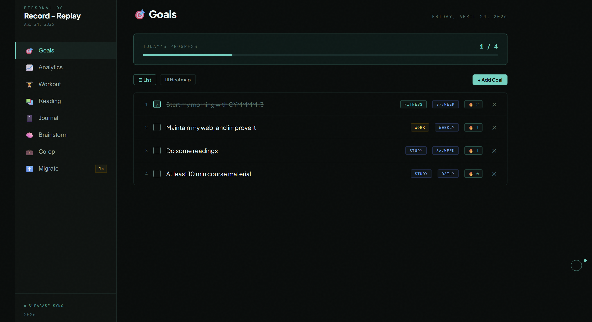

# Personal-OS-Cassette-Backend

# 4 Your Eyes Only album inspired — Personal OS

A personal productivity dashboard. Single HTML file, no framework, powered by Supabase for cross-device sync.




🎬 Demo: [Watch the demo](./Personal-OS-Demo.mp4)

---

## Features

| Tab | What it does |
|-----|-------------|
| 🎯 Goals | Daily/weekly habit tracker with streaks and heatmap |
| 📈 Analytics | 7-day goal completion chart |
| 🏋️ Workout | Log exercise sessions, track weekly/monthly volume |
| 📚 Reading | Book/article tracker with status and backlog |
| 📓 Journal | Dated entries with type tags (podcast, work, reflection…) |
| 🧠 Brainstorm | Capture ideas, dreams, worries, projects |
| 💼 Co-op | Job application tracker with interview/offer rates |
| ⬆️ Migrate | One-time tool to import data from localStorage → Supabase |

---

## Stack

- **Frontend** — Plain HTML + React 18 (via CDN, no build step)
- **Database** — Supabass
- **Hosting** — GitHub Pages
- **Fonts** — IBM Plex Mono, Plus Jakarta Sans

---

## Supabase Setup

### Table: `personal_os`

| Column | Type | Nullable | Default |
|--------|------|----------|---------|
| `id` | int8 | No | auto |
| `key` | text | No | — |
| `value` | jsonb | No | — |
| `updated_at` | timestamptz | No | `now()` |
| `owner` | text | No | `choose_your_own` |

`key` is unique. Each tab maps to one row (e.g. `goals:v5`, `workout:v4`).

### Row Level Security

RLS is **enabled** with 4 policies (SELECT / INSERT / UPDATE / DELETE), all targeting the `anon` role:

```sql
-- SELECT & DELETE
using ( owner = 'choose_your_own' )

-- INSERT
with check ( owner = 'choose_your_own' )

-- UPDATE
using ( owner = 'choose_your_own' )
with check ( owner = 'choose_your_own' )
```

This means the anon key is safe to expose — requests without the correct `owner` value are rejected at the database level.

---

## Local Development

No build step needed. Just open `src/main.html` directly in a browser, or use VS Code Live Server for a local server:

```
Extensions → search "Live Server" → Install → right-click main.html → Open with Live Server
```

---

## Deployment

```bash
git add .
git commit -m "update"
git push origin main
```

GitHub Pages serves from the `main` branch root. The live URL is:
```
https://<username>.github.io/<repo-name>/
```

---

## Data Migration

If you have existing data in localStorage from a previous version, open the **⬆️ Migrate** tab and click **Migrate All to Supabase**. Run once, then ignore the tab.

---

## Storage Keys

| Key | Tab |
|-----|-----|
| `goals:v5` | Goals |
| `workout:v4` | Workout |
| `reading:v5` | Reading |
| `journal:v6` | Journal |
| `brain:v3` | Brainstorm |
| `coop:v4` | Co-op |
